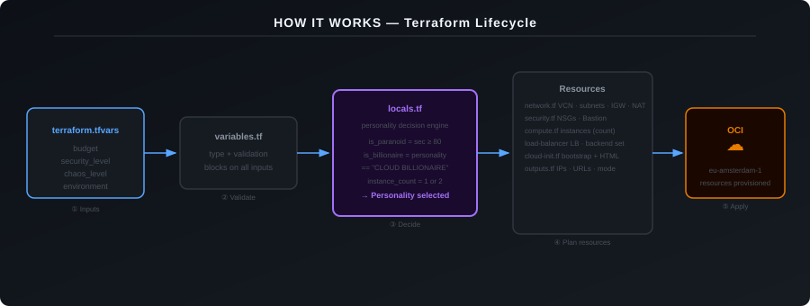
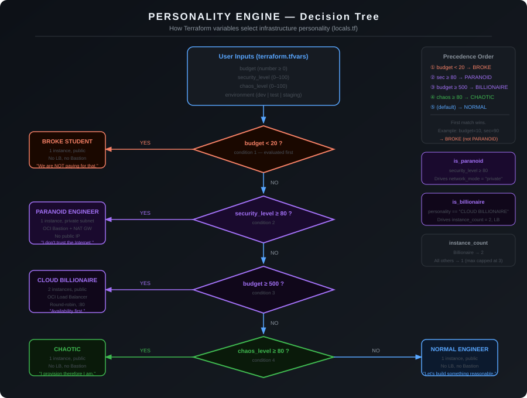
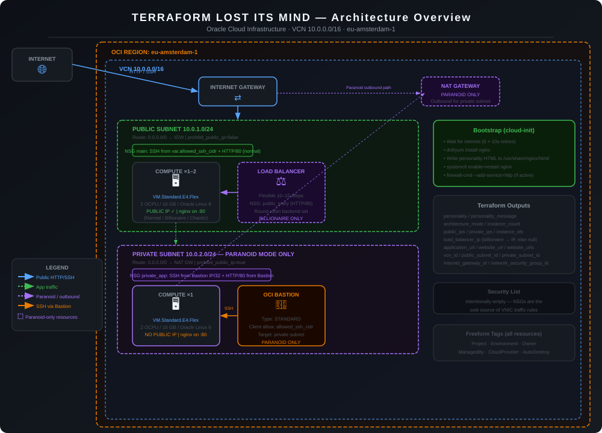
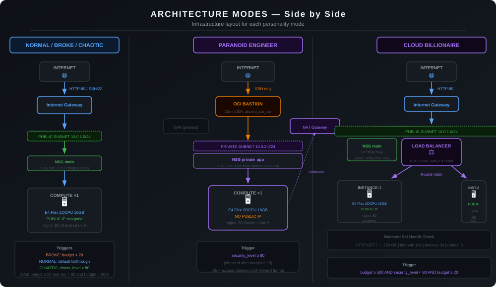
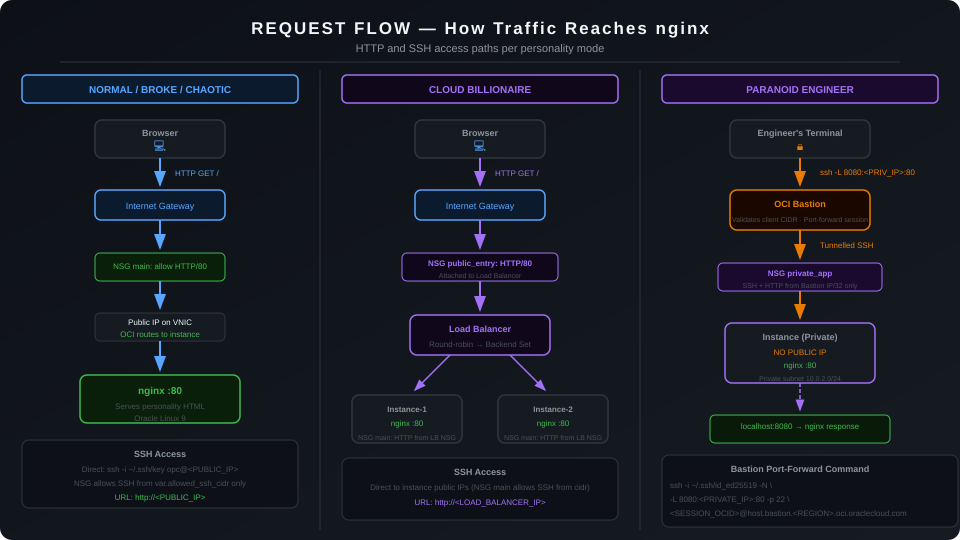

# Terraform Lost Its Mind

> An OCI infrastructure personality engine. Three numeric inputs decide whether Terraform provisions a single public VM, a hardened private instance accessible only via OCI Bastion, or a load-balanced Compute pair — with zero code changes required.


[](https://www.terraform.io/)
[](https://registry.terraform.io/providers/oracle/oci/latest)
[](https://www.oracle.com/cloud/)

---

## What Is This?

Most Terraform configurations provision a static set of resources. This project takes a different approach: it reads three numeric variables — **budget**, **security_level**, and **chaos_level** — and uses a decision engine in `locals.tf` to select an infrastructure personality.

The active personality determines the entire OCI networking and compute architecture:
* Subnet routing (Public vs. Private)
* Public IP allocation
* Compute instance count (1 vs. 2)
* Network Security Group (NSG) traffic rules
* Conditional deployment of OCI Bastion, OCI NAT Gateway, and OCI Load Balancer

The provisioned OCI Compute instances run an nginx web server bootstrapped via `cloud-init`. The server hosts a dynamic terminal-style web page that displays the active personality, input values, and current infrastructure status.

---

## Why I Built It

This repository demonstrates advanced Terraform conditional logic and Oracle Cloud Infrastructure architecture patterns:

* **Conditional resource creation** — Using `count` and ternary logic to provision resources like OCI Bastion, OCI NAT Gateway, and OCI Load Balancer only when required.
* **Dynamic instance management** — Scaling instance count via `locals` and iterating with `for_each` for Load Balancer backends.
* **Strict network isolation** — Centralizing all security policy in OCI Network Security Groups (NSGs) while leaving VCN Security Lists empty.
* **Templated bootstrapping** — Passing dynamic infrastructure metadata into `cloud-init` scripts and HTML templates using Terraform `templatefile()`.

---

## How It Works



1. **User Inputs**: Variables are passed via `terraform.tfvars`.
2. **Validation**: `variables.tf` enforces type constraints and acceptable ranges.
3. **Decision Engine**: `locals.tf` evaluates input conditions to determine the personality and architecture flags (`is_paranoid`, `is_billionaire`).
4. **Resource Provisioning**: Terraform evaluates conditional blocks across `network.tf`, `security.tf`, `compute.tf`, and `load-balancer.tf`.
5. **OCI Deployment**: Resources are created in Oracle Cloud Infrastructure (`eu-amsterdam-1`).

---

## Personality Engine



Personalities are selected using a chained ternary expression in `locals.tf`. **Condition precedence is strictly top-to-bottom — the first matching condition wins.**

```hcl
personality = (
  var.budget         < 20  ? "BROKE STUDENT"     :
  var.security_level >= 80 ? "PARANOID ENGINEER" :
  var.budget         >= 500 ? "CLOUD BILLIONAIRE" :
  var.chaos_level    >= 80 ? "CHAOTIC"           :
  "NORMAL ENGINEER"
)
```

### Personality Precedence Table

| Priority | Condition | Personality | Personality Message |
|:---:|---|---|---|
| **1** | `budget < 20` | **BROKE STUDENT** | *"We are NOT paying for that."* |
| **2** | `security_level >= 80` | **PARANOID ENGINEER** | *"I don't trust the Internet."* |
| **3** | `budget >= 500` | **CLOUD BILLIONAIRE** | *"Availability first. Money later."* |
| **4** | `chaos_level >= 80` | **CHAOTIC** | *"I provision therefore I am."* |
| **5** | *(default)* | **NORMAL ENGINEER** | *"Let's build something reasonable."* |

> **Important Precedence Rule:** `budget < 20` is evaluated first. If `budget = 10` and `security_level = 95`, the resulting personality is **BROKE STUDENT** because condition 1 overrides condition 2.

### Derived Architecture Flags

Infrastructure components are controlled by derived boolean flags:

| Local Flag | Condition | Impact on OCI Infrastructure |
|---|---|---|
| `is_paranoid` | `security_level >= 80` | Deploys VM in Private Subnet (`10.0.2.0/24`), disables Public IP, provisions OCI Bastion & OCI NAT Gateway. |
| `is_billionaire` | `personality == "CLOUD BILLIONAIRE"` | Increases `instance_count` to 2 and provisions an OCI Load Balancer. |

---

## Architecture Overview



### Base Infrastructure (Always Provisioned)
* **OCI VCN**: `10.0.0.0/16` (`main_vcn`)
* **OCI Internet Gateway**: Handles outbound and public internet traffic
* **OCI Public Subnet**: `10.0.1.0/24` with route rule to Internet Gateway
* **OCI Security List**: Empty placeholder (`nsg_only`) — all traffic rules are handled by NSGs
* **OCI Network Security Group (`main`)**: Primary security boundary for compute instances

### Conditional Infrastructure

| Component | Resource Type | Active Mode / Trigger |
|---|---|---|
| **OCI Private Subnet** | `oci_core_subnet.private` | Paranoid Mode (`security_level >= 80`) |
| **OCI NAT Gateway** | `oci_core_nat_gateway.paranoid` | Paranoid Mode (`security_level >= 80`) |
| **OCI Private Route Table** | `oci_core_route_table.private` | Paranoid Mode (`security_level >= 80`) |
| **OCI Bastion** | `oci_bastion_bastion.paranoid` | Paranoid Mode (`security_level >= 80`) |
| **OCI Load Balancer** | `oci_load_balancer_load_balancer.main` | Cloud Billionaire Mode (`budget >= 500`) |
| **OCI LB Backend Set** | `oci_load_balancer_backend_set.app` | Cloud Billionaire Mode (`budget >= 500`) |
| **OCI LB Listener** | `oci_load_balancer_listener.http` | Cloud Billionaire Mode (`budget >= 500`) |

---

## Architecture Modes



### 1. Standard Public Mode (Normal / Broke / Chaotic)
* **Compute**: 1 × OCI Compute instance in Public Subnet (`10.0.1.0/24`)
* **Networking**: Direct Public IP assigned
* **Security**: NSG `main` permits HTTP (port 80) from `0.0.0.0/0` and SSH (port 22) from `allowed_ssh_cidr`
* **Entry Point**: Direct access via Public IP (`http://<PUBLIC_IP>`)

### 2. Paranoid Mode (Paranoid Engineer)
* **Compute**: 1 × OCI Compute instance in Private Subnet (`10.0.2.0/24`)
* **Networking**: No Public IP assigned (`prohibit_public_ip_on_vnic = true`)
* **Outbound Traffic**: Outbound internet traffic routed through OCI NAT Gateway for software updates
* **Management & HTTP Access**: Managed via OCI Bastion standard service
* **Security**: NSG `private_app` permits port 22 and port 80 strictly from the OCI Bastion private endpoint IP address (`/32`)

### 3. Cloud Billionaire Mode (Cloud Billionaire)
* **Compute**: 2 × OCI Compute instances in Public Subnet (`10.0.1.0/24`)
* **Load Balancer**: OCI Flexible Load Balancer (10–10 Mbps) with Round-Robin backend policy
* **Health Checks**: HTTP GET check on `/` every 10 seconds (port 80)
* **Security**: NSG `public_entry` handles public HTTP traffic on port 80. NSG `main` restricts port 80 ingress on backend instances to traffic originating from NSG `public_entry` only.

---

## Request Flow



* **Standard Mode**: `Browser ──► Internet Gateway ──► Public Instance (port 80)`
* **Billionaire Mode**: `Browser ──► OCI Load Balancer ──► Round-Robin Backend Set ──► Instances (port 80)`
* **Paranoid Mode**: `User Terminal ──► OCI Bastion SSH Tunnel ──► Private Instance (port 80)`

---

## Prerequisites

* **Terraform**: `>= 1.5.0`
* **OCI Provider**: `oracle/oci` (`~> 6.0`)
* **Oracle Cloud Account**: Tenancy access with permissions to create VCN, Compute, Load Balancer, and Bastion resources
* **OCI API Signing Key**: Pair of RSA keys (`.pem` format) added to your OCI User Profile
* **SSH Key Pair**: Public key for instance initialization

---

## OCI Authentication

The OCI Terraform provider in `provider.tf` authenticates directly using API signing keys declared via variables:

```hcl
provider "oci" {
  tenancy_ocid     = var.tenancy_ocid
  user_ocid        = var.user_ocid
  fingerprint      = var.fingerprint
  region           = var.region
  private_key_path = var.private_key_path
}
```

Credentials can also be referenced from a standard OCI configuration file (`~/.oci/config`):

```ini
[DEFAULT]
user=ocid1.user.oc1..exampleuserocid
fingerprint=20:3b:97:13:55:1c:5b:0d:d3:37:d8:50:4e:c5:3a:26
tenancy=ocid1.tenancy.oc1..exampletenancyocid
region=eu-amsterdam-1
key_file=/home/user/.oci/oci_api_key.pem
```

> ⚠️ **Security Warning**: Never commit `terraform.tfvars`, `.pem` key files, or `terraform.tfstate` files to version control. They are excluded by `.gitignore`.

---

## Input Variables

### Authentication & Compartment (Required)

| Variable | Type | Sensitive | Description |
|---|:---:|:---:|---|
| `user_ocid` | `string` | Yes | OCID of the OCI API user |
| `tenancy_ocid` | `string` | Yes | OCID of the OCI tenancy |
| `fingerprint` | `string` | Yes | Fingerprint of the OCI API signing key |
| `private_key_path` | `string` | Yes | Absolute local path to private `.pem` key |
| `compartment_id` | `string` | No | OCID of target OCI compartment |

### Personality Controls (Required)

| Variable | Type | Validation Constraint | Description |
|---|:---:|---|---|
| `budget` | `number` | `>= 0` | Budget parameter influencing personality selection |
| `security_level` | `number` | `0` to `100` | Security level triggering Paranoid Mode (`>= 80`) |
| `chaos_level` | `number` | `0` to `100` | Chaos level triggering Chaotic Mode (`>= 80`) |
| `environment` | `string` | `dev`, `test`, `staging` | Environment name used in resource tags |

### Networking & Compute (Required / Optional)

| Variable | Type | Default | Description |
|---|:---:|---|---|
| `allowed_ssh_cidr` | `string` | *(Required)* | Trusted CIDR block permitted for SSH access |
| `ssh_public_key` | `string` | *(Required)* | SSH public key string inserted into instance `user_data` |
| `region` | `string` | `"eu-amsterdam-1"` | Target OCI region |
| `instance_shape` | `string` | `"VM.Standard.E4.Flex"` | OCI Compute Flex shape |
| `project_name` | `string` | `"terraform-lost-its-mind"` | Project tag prefix for display names |
| `owner` | `string` | `"abdulrehman-yahya"` | Resource owner tag |
| `managed_by` | `string` | `"Terraform"` | Infrastructure management tool tag |
| `cloud_provider` | `string` | `"OCI"` | Cloud provider tag |

---

## Deployment Workflow

### 1. Configure Local Environment
Create `terraform/environment/terraform.tfvars`:

```hcl
user_ocid        = "ocid1.user.oc1..example"
tenancy_ocid     = "ocid1.tenancy.oc1..example"
fingerprint      = "xx:xx:xx:xx:xx:xx:xx:xx:xx:xx:xx:xx:xx:xx:xx:xx"
private_key_path = "/home/user/.oci/oci_api_key.pem"
compartment_id   = "ocid1.compartment.oc1..example"

allowed_ssh_cidr = "203.0.113.5/32"
ssh_public_key   = "ssh-ed25519 AAAAC3NzaC1lZDI1NTE5..."

budget         = 100
security_level = 50
chaos_level    = 20
environment    = "dev"
```

### 2. Initialize and Validate
```bash
cd terraform/environment
terraform init
terraform validate
```

### 3. Generate Execution Plan
Always save the plan output to lock interactive variable inputs across plan and apply phases:

```bash
terraform plan -out=tfplan
```

### 4. Apply Infrastructure
```bash
terraform apply tfplan
```

---

## Example Personality Runs

| Inputs (`budget`, `security_level`, `chaos_level`) | Active Personality | Infrastructure Provisioned |
|---|---|---|
| `budget = 10`, `security_level = 90`, `chaos_level = 90` | **BROKE STUDENT** | 1 × Public Compute Instance (Budget condition takes precedence). |
| `budget = 100`, `security_level = 85`, `chaos_level = 10` | **PARANOID ENGINEER** | 1 × Private Instance, OCI Bastion, OCI NAT Gateway, Private Subnet. |
| `budget = 600`, `security_level = 20`, `chaos_level = 10` | **CLOUD BILLIONAIRE** | 2 × Public Instances, OCI Flexible Load Balancer, Round-Robin Backend Set. |
| `budget = 100`, `security_level = 30`, `chaos_level = 90` | **CHAOTIC** | 1 × Public Compute Instance. |
| `budget = 100`, `security_level = 30`, `chaos_level = 20` | **NORMAL ENGINEER** | 1 × Public Compute Instance (Default fallback). |

---

## Terraform Outputs

| Output Name | Description | Active In Modes |
|---|---|---|
| `personality` | Name of the evaluated personality | All Modes |
| `personality_message` | Quoted string from personality engine | All Modes |
| `architecture_mode` | Mode description (`STANDARD PUBLIC` or `PARANOID PRIVATE`) | All Modes |
| `instance_count` | Number of instances provisioned (1 or 2) | All Modes |
| `public_ips` | List of public IP addresses assigned | Standard & Billionaire (`[]` in Paranoid) |
| `private_ips` | List of private IP addresses assigned | All Modes |
| `load_balancer_ip` | Public IP address of OCI Load Balancer | Billionaire Mode (`null` otherwise) |
| `application_url` | Primary URL for accessing the application | Standard & Billionaire (`null` in Paranoid) |
| `website_url` | Primary website URL | Standard & Billionaire (`null` in Paranoid) |
| `website_urls` | List of all accessible public website URLs | Standard & Billionaire (`[]` in Paranoid) |
| `vcn_id` | OCID of the created VCN | All Modes |
| `public_subnet_id` | OCID of the public subnet | All Modes |
| `private_subnet_id` | OCID of the private subnet | Paranoid Mode (`null` otherwise) |

---

## Accessing the Application

### Standard & Billionaire Modes
Access the application directly in your web browser using the output URL:

```bash
# Standard Mode (Direct Instance IP)
http://<PUBLIC_IP>

# Billionaire Mode (Load Balancer IP)
http://<LOAD_BALANCER_IP>
```

### Paranoid Mode (OCI Bastion Port Forwarding)

In Paranoid Mode, instances have no Public IP address. Access requires creating an **OCI Bastion SSH Port Forwarding Session**.

1. Create a Managed SSH Port Forwarding Session via OCI Console or OCI CLI targeting port 80 of the instance's private IP (`private_ips[0]`).
2. Run the SSH port forwarding command provided by OCI:

```bash
ssh -i ~/.ssh/id_ed25519 \
  -N \
  -L 8080:<PRIVATE_IP>:80 \
  -p 22 \
  <BASTION_SESSION_OCID>@host.bastion.<REGION>.oci.oraclecloud.com
```

3. Open your local browser to access the website:
```text
http://localhost:8080
```

---

## Security Model

* **NSG Centralization**: Subnet Security Lists are left empty (`nsg_only`). Network traffic is strictly enforced by OCI Network Security Groups attached directly to VNICs.
* **SSH CIDR Isolation**: In Standard Mode, SSH ingress on port 22 is restricted to `var.allowed_ssh_cidr`.
* **Private Network Enclosure**: In Paranoid Mode, instances receive no Public IP. Ingress traffic on port 22 and port 80 is restricted strictly to the OCI Bastion private endpoint IP (`/32`).
* **Load Balancer Isolation**: In Billionaire Mode, backend compute instances reject direct HTTP requests from the internet and accept port 80 ingress exclusively from the Load Balancer NSG (`public_entry`).

---

## Troubleshooting

### 1. `502 Bad Gateway` on Load Balancer (Billionaire Mode)
* **Cause**: Backend health checks require 1–2 minutes after `apply` while nginx initializes via `cloud-init`.
* **Resolution**: Monitor health status in OCI Console under Load Balancer Backend Sets. Verify nginx status on instances.

### 2. Bastion Session Connection Timeout (Paranoid Mode)
* **Cause**: Ingress rules on NSG `private_app` must match the Bastion private endpoint IP.
* **Resolution**: Verify that the OCI Bastion state is `ACTIVE` and that client CIDR in `allowed_ssh_cidr` permits your current local public IP.

### 3. API Authentication Errors (`401 Unauthenticated`)
* **Cause**: Mismatch between `fingerprint`, `private_key_path`, or `user_ocid`.
* **Resolution**: Verify fingerprint using `openssl rsa -pubout -outform DER -in ~/.oci/oci_api_key.pem | openssl md5 -c`.

---

## Infrastructure Cleanup

To destroy all provisioned OCI resources:

```bash
cd terraform/environment
terraform destroy
```

> ⚠️ **Caution**: `terraform destroy` will terminate all Compute instances, VCN subnets, Gateways, Load Balancers, and Bastion sessions associated with the state file.

---

## Cost Awareness

This repository provisions standard OCI resources. Depending on the active personality mode, costs may apply:

| Component | Cost Impact |
|---|---|
| **OCI Compute (`VM.Standard.E4.Flex`)** | Billed per OCPU/GB memory hour (2 OCPU / 16 GB per VM). |
| **OCI Load Balancer** | Flexible Load Balancer hourly charge + data transfer. |
| **OCI NAT Gateway** | Hourly charge for gateway usage in Paranoid Mode. |
| **OCI Bastion** | Free service tier (subject to regional session limits). |

Always run `terraform destroy` when testing is complete.
